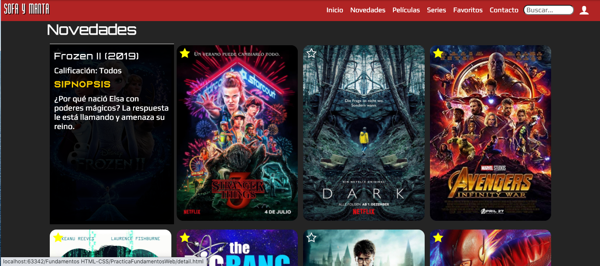

# PracticaFundamentosWeb

### Introducción

Practica realizada para el módulo de HTML/CSS del Bootcamp Full Stack Web.

La Practica debia contar con una página de Login, una página Princial donde mostrar el contenido de la web y una página de detalles.

La página debia ser responsive.

### Descarga

Abrimos un terminal y clonamos el repositorio a nuestra ubicación en local.

`git clone https://github.com/jsignoretfdez/PracticaFundamentosWeb.git`

### Capturas

